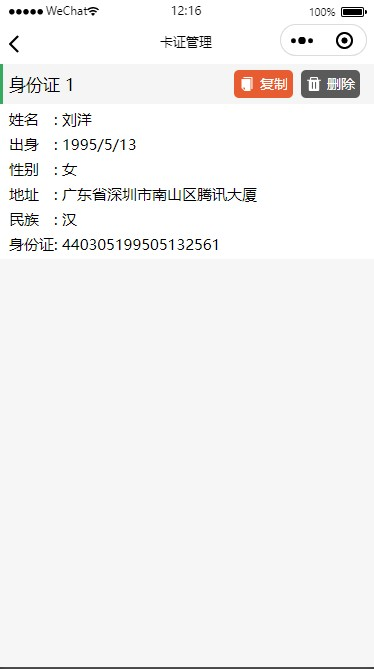
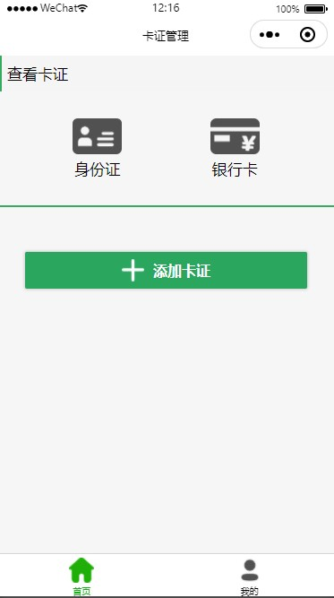
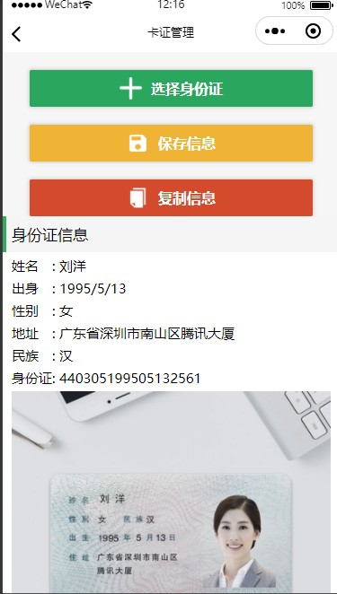

# 卡包


## 介绍

识别和存放个人卡证信息


## 使用

小程序云函数借助了腾讯的卡证识别api来获取信息。

所以需要对以下内容进行配置 `cloudfunctions/recognizeCard/index.js`

```javascript
// 云函数入口函数
exports.main = async (event, context) => {
	// 腾讯卡证识别api配置
    let AppId = '';
    let SecretId = '';
    let SecretKey = '';
    ...
}
```

**如果你参考了该项目，我十分建议你将该配置移到单独文件，以防误传到公开平台**


## 预览

> 下面预览图中证件来自腾讯云官方实例，仅供测试

 

 

 

